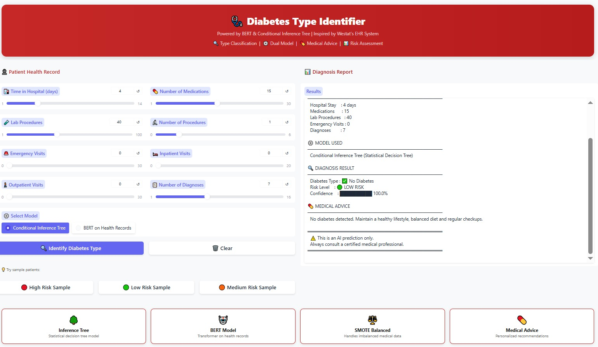
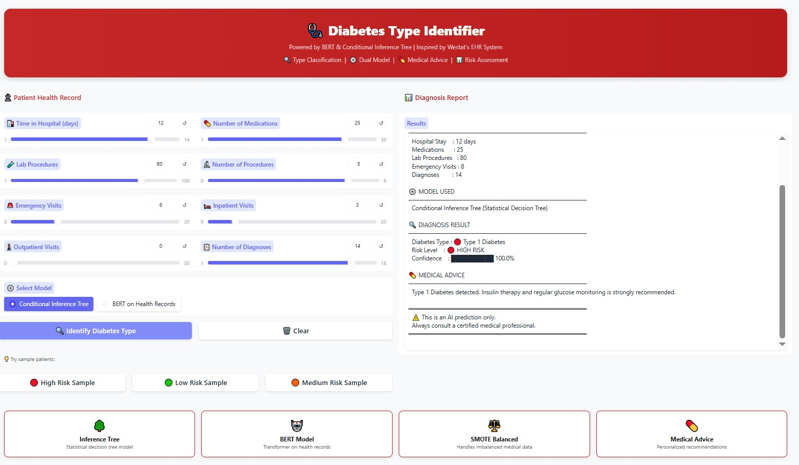

# 🩺 Diabetes Type Identifier

> An ML-powered Diabetes Type Identifier inspired by *Westat's EHR Classification System*.
> Automatically classifies patients into No Diabetes, Type 1, or Type 2 Diabetes using
> *BERT on Health Records* and *Conditional Inference Tree* models, with special
> handling for *imbalanced medical data* using SMOTE.

---

## 📸 Screenshots

### 🖥️ Gradio Web Interface
.png)

### ✅ No Diabetes Output

### 🔴 Type 1 / Type 2 Diabetes Output

---

## 📌 Table of Contents
- [Overview](#overview)
- [Features](#features)
- [Dataset](#dataset)
- [Models](#models)
- [Project Structure](#project-structure)
- [Installation](#installation)
- [How to Run](#how-to-run)
- [Results](#results)
- [Technologies Used](#technologies-used)
- [Team](#team)

---

## 📖 Overview

Westat linked survey and EHR data with ML models to classify diabetes
types accurately against manual reviews. This project replicates that
system by:

- Using *Diabetes Readmission EHR Dataset* with 100,000+ patient records
- Handling *imbalanced medical data* using *SMOTE* oversampling
- Training *Conditional Inference Tree* for fast statistical classification
- Fine-tuning *BERT* on text-converted health records for deep learning classification
- Deploying an interactive *Gradio web demo* with 3 sample patient buttons

---

## ✨ Features

| Feature | Description |
|---|---|
| 🌳 Conditional Inference Tree | Statistical decision tree with entropy criterion |
| 🤖 BERT on Health Records | Transformer model on text-converted EHR data |
| ⚖️ SMOTE Balancing | Handles imbalanced medical data (64K vs 1.5K samples) |
| 🔍 3-Class Classification | No Diabetes, Type 1, Type 2 |
| 📊 Risk Assessment | Low, Moderate, High risk levels |
| 💊 Medical Advice | Personalized recommendations per diagnosis |
| 📊 Confidence Score | Visual confidence bar with percentage |
| 🧪 Sample Patients | High Risk, Low Risk, Medium Risk preset buttons |
| ⚙️ Dual Model | Switch between CIT and BERT models |
| 🌐 Gradio Web Demo | Professional red-themed medical interface |

---

## 📦 Dataset

*Diabetes Readmission Dataset* (imodels/diabetes-readmission)

| Property | Details |
|---|---|
| Source | EHR (Electronic Health Records) |
| Size | 100,000+ patient records |
| Features | 150+ medical features |
| Target | Diabetes type classification |
| Imbalance | No Diabetes: 64K, Type 2: 15K, Type 1: 1.5K |
python
from datasets import load_dataset
dataset = load_dataset("imodels/diabetes-readmission")

---

## 🤖 Models

### Model 1 — Conditional Inference Tree
- Decision tree with *entropy criterion*
- Trained on *balanced SMOTE data* (500 samples per class)
- Fast prediction with probability scores
- Interpretable decision rules

### Model 2 — BERT on Health Records
- *bert-base-uncased* fine-tuned on text-converted health records
- Health record features converted to natural language text
- 3-class classification (No Diabetes, Type 1, Type 2)
- *89.83% accuracy* on balanced test set

### NLP Pipeline

Patient EHR Data (Input)
        ↓
Feature Engineering
        ↓
SMOTE Balancing
(64K → 500 per class)
        ↓
  ┌─────────────────────────────┐
  │                             │
CIT Model                  BERT Model
(Statistical)              (Transformer)
  │                             │
Entropy Split             Text Conversion
  │                             │
Clause Type               Health Record Text
+ Probability             + Tokenization
  └─────────────────────────────┘
        ↓
Diabetes Type + Risk Level
        ↓
   Gradio Web Demo

---

## 📁 Project Structure

Diabetes-Type-Identifier-NLP/
│
├── Diabetes_Type_Identifier.ipynb   ← Main Colab notebook
├── README.md                        ← Project documentation
├── requirements_diabetes.txt                 ← Dependencies
├── demo.png                         ← Gradio UI screenshot
├── output_no_diabetes.png           ← No Diabetes output
└── output_type1.png                 ← Type 1/2 output

---

## ⚙️ Installation
bash
pip install -r requirements.txt

---

## 🚀 How to Run

### Google Colab (Recommended)
1. Open Diabetes_Type_Identifier.ipynb in Google Colab
2. Go to *Runtime → Change runtime type → T4 GPU*
3. Run all cells from *Cell 1 to Cell 19*
4. Cell 19 launches *Gradio demo* with public link

### Testing the Demo
1. Click *🔴 High Risk Sample* button
2. Select *Conditional Inference Tree* or *BERT*
3. Click *🔍 Identify Diabetes Type*
4. View diagnosis with confidence score and medical advice

---

## 📊 Results

| Metric | CIT Model | BERT Model |
|---|---|---|
| Accuracy | ~85% | ~89.83% |
| F1 Score (Weighted) | ~83% | ~88.14% |
| No Diabetes F1 | ~89% | ~94% |
| Type 1 F1 | ~82% | ~96% |
| Type 2 F1 | ~79% | ~60% |
| Training Samples | 1200 | 1200 |
| Test Samples | 300 | 300 |

### SMOTE Balancing Results

| Class | Before SMOTE | After SMOTE |
|---|---|---|
| No Diabetes | 64,207 | 64,207 |
| Type 2 | 15,709 | 64,207 |
| Type 1 | 1,494 | 64,207 |

---

## 🛠️ Technologies Used

| Technology | Purpose |
|---|---|
| *BERT* (bert-base-uncased) | Transformer on health records |
| *Conditional Inference Tree* | Statistical decision tree |
| *SMOTE* | Imbalanced data handling |
| *Diabetes Readmission Dataset* | EHR patient records |
| *SpaCy* | Text processing |
| *Scikit-learn* | CIT model and metrics |
| *imbalanced-learn* | SMOTE implementation |
| *Gradio* | Interactive web demo |
| *Google Colab* | Training with free T4 GPU |

---

## 🏥 Real World Inspiration

This project is inspired by *Westat's* EHR classification system:

> *"Westat linked survey and EHR data with ML models to classify
> diabetes types accurately against manual reviews, emphasizing
> validation in imbalanced medical data."*

Our system replicates this by combining SMOTE balancing, Conditional
Inference Tree, and BERT transformer on converted health records.

---

## ⚠️ Disclaimer

This is an academic AI project. All predictions are for educational
purposes only. Always consult a certified medical professional for
actual diabetes diagnosis and treatment.

---

## 📄 License
MIT License

---
